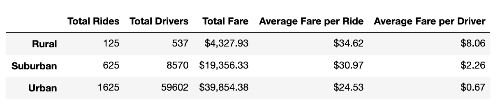
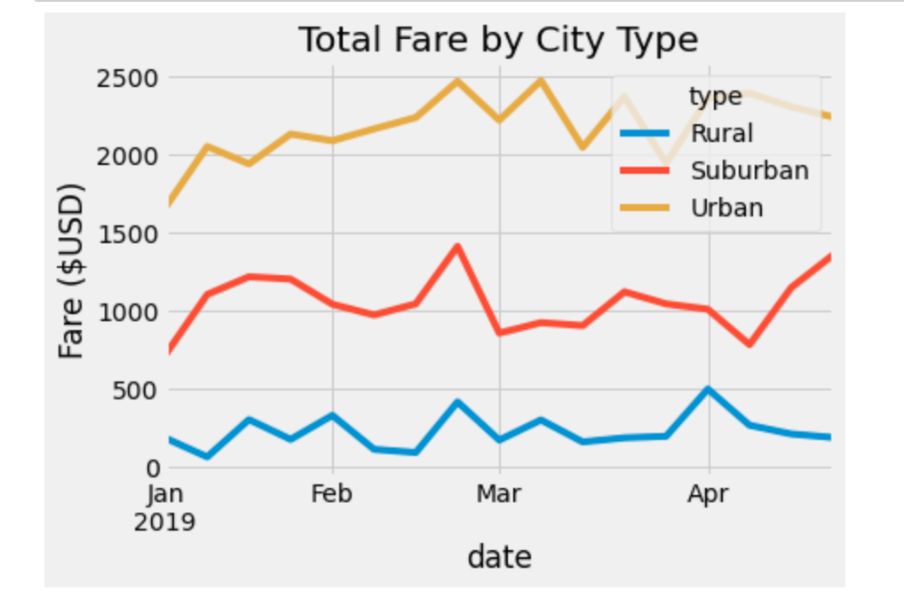

# PyBer Analysis
## Overview of the Analysis
This analysis was done for PyBer, a ride-sharing company that offers services in urban, rural, and suburban areas. The purpose of this analysis was to show the differences in fare costs for urban, suburban, and rural cities. Data for number of drivers, number of rides, and fare costs were analyzed.
## Results
Overall, there were major differences among the city types for fare costs. As could be expected, urban cities by far had the most drivers, rides, and the highest total fare amount. However, urban cities also had the lowest fare cost per ride and per driver. The results are shown in the table and line graph below.   
Fig. 1: Table Comparison  
  
Fig. 2: Line Graph  
  
## Summary
Three business recommendations based on the analysis are:  
1. Expanding the number of drivers in rural and suburban areas to keep up with the urban areas
2. Raising the fare amounts in urban cities so that the total fare is greater
3. Reducing the number of drivers in urban cities so that drivers are more fairly compensated 
